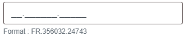

## InputMask

Champ de saisie de texte avec un masque de saisie lié à une expression régulière.

### Props

#### Obligatoires

| Nom  | Type   | Commentaire                               |
| ---- | ------ | ----------------------------------------- |
| name | Chaine | Le nom du champ, en snakeCase si possible |
| mask | Chaine | Masque de saisie                          |

#### Optionnels

| Nom          | Type     | Remarque | Commentaire                                       |
| ------------ | -------- | -------- | ------------------------------------------------- |
| id           | Chaine   |          | Identifiant                                       |
| label        | Chaine   |          | Le libellé du champ, sans html                    |
| value        | Chaine   |          | La valeur                                         |
| onChange     | Fonction |          | onChange(event)                                   |
| disabled     | Booléen  | Faux     | Pour désactiver le champ                          |
| required     | Booléen  | Faux     | Pour rendre le champ obligatoire                  |
| labelTop     | Booléen  | Vrai     | Le libellé s'affiche au dessus du champ           |
| size         | Taille   |          | Pour changer la taille par défaut                 |
| labelSize    | Taille   | 6        | Taille du libellé                                 |
| inputSize    | Taille   | 30       | Taille du champ de saisie                         |
| error        | Element  |          | Gestion du champ en erreur                        |
| warning      | Element  |          | Gestion du champ en anomalie                      |
| autoComplete | Chaine   | off      | Type d'autocomplétion à utiliser                  |
| placeholder  | Chaine   | ''       | Texte indicatif dans le champ de saisie           |
| pattern      | Chaine   |          | Modèle de saisie (expression régulière) !!        |
| className    | Chaine   |          | Gestion Attribut class                            |
| maxLength    | Nombre   | 9999     | Nombre de caractères maximal qui peut être saisie |
| help         | Element  |          | Elément d'aide sous le champ                      |

#### Fonctions appelées

| Nom          | Type     | Remarque | Commentaire                                       |
| ------------ | -------- | -------- | ------------------------------------------------- |
| onChange     | Fonction |          | onChange(event)                                   |


### Spécificités

- Si 'id' non renseigné, l'identifiant sera 'name'
- Si 'error' ou 'warning' sont renseignés, le champ sera invalide  et
  l'élement erreur anomalie sera ajouté après
  (le plus souvent celà sera un message d'erreur en dessous)
- le masque de saisie doit correspondre au modèle (pattern) !!  S'il n'y a pas de pattern, il n'y a pas de contrôle

### Exemple

```
<InputMask
  label="N°"
  name="ct_code"
  value={values.ct_code}
  mask={'aa.000000.00000'}
  pattern={"(?<pays>[A-Z]{2})\.(?<principal>[0-9]{6})\.(?<ordre>[0-9]{5})"}
  error={getErrorMessage('ct_code')}
  help={'Format : FR.353032.24743'}
/>
```

