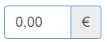

## InputMonetary

Champ de saisie de texte avec un masque de saisie pour ne pouvoir saisir que des montants

### Props

#### Obligatoires

| Nom  | Type   | Commentaire                               |
| ---- | ------ | ----------------------------------------- |
| name | Chaine | Le nom du champ, en snakeCase si possible |
| mask | Chaine | Masque de saisie                          |

#### Optionnels

| Nom          | Type     | Remarque | Commentaire                                |
| ------------ | -------- | -------- | ------------------------------------------ |
| id           | Chaine   |          | Identifiant                                |
| label        | Chaine   |          | Le libellé du champ, sans html             |
| value        | Chaine   |          | La valeur                                  |
| disabled     | Booléen  | Faux     | Pour désactiver le champ                   |
| required     | Booléen  | Faux     | Pour rendre le champ obligatoire           |
| labelTop     | Booléen  | Vrai     | Le libellé s'affiche au dessus du champ    |
| size         | Taille   |          | Pour changer la taille par défaut          |
| labelSize    | Taille   | 6        | Taille du libellé                          |
| inputSize    | Taille   | 30       | Taille du champ de saisie                  |
| error        | Element  |          | Gestion du champ en erreur                 |
| warning      | Element  |          | Gestion du champ en anomalie               |
| autoComplete | Chaine   | off      | Type d'autocomplétion à utiliser           |
| placeholder  | Chaine   | ''       | Texte indicatif dans le champ de saisie    |
| pattern      | Chaine   |          | Modèle de saisie (expression régulière) !! |
| language     | Chaine   | 'fr-FR'  |                                            |
| money        | Chaine   | 'EUR'    | Util pour changement de Money              |
| inputMoney   | Chaine   | 'EUR'    | Monnaie                                    |
| swapIcon     | Element  |          | Bouton Icone Monnaie                       |

#### Fonctions appelées

| Nom           | Type     | Remarque | Commentaire     |
| ------------- | -------- | -------- | --------------- |
| onChange      | Fonction |          | onChange(event) |
| onMoneySwitch | Fonction |          | onMoneySwitch() |

### Spécificités

- Si 'id' non renseigné, l'identifiant sera 'name-' valeur aléatoire entre 10000 et 99999
- Si 'error' ou 'warning' sont renseignés, le champ sera invalide  et
  l'élement erreur anomalie sera ajouté après
  (le plus souvent celà sera un message d'erreur en dessous)
- money utilisé lorsque l'on change de monnaie (appelé avec dbMoney ??)

### Exemple

```
<InputMonetary
  label="Montant"
  labelTop={true}
  name="ct_mount"
  inputMoney="€"
  dbMoney="€"
  value={values.ct_mount}
/>
```


### To Do

- Ajouter et gérer l'attribut className ?
- Ajouter et gérer l'attribut help ?
- Explication du fonctionnement du changement de monnaie ????
