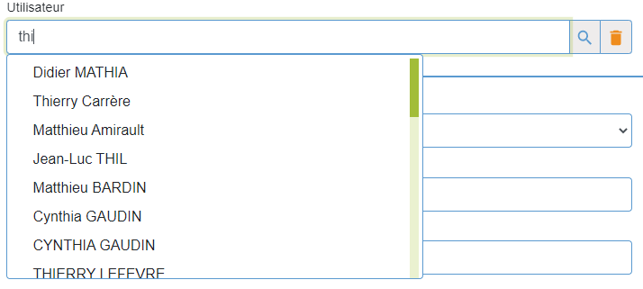
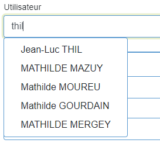

## InputPicker

Champ de saisie avec sélection dans une liste de résultats.

### Props

#### Obligatoires

| Nom       | Type     | Commentaire                                   |
| --------- | -------- | --------------------------------------------- |
| name      | Chaine   | Le nom du champ, en snakeCase si possible     |
| label     | Chaine   | Le libellé du champ                           |
| list      | Element  | Liste de résultats trouvée avec la saisie     |
| onClear   | Fonction | Action qui vide le champ                      |
| onMore    | Fonction | Action qui ouvre la fenêtre de recherche      |
| onChange  | Fonction | onChange(event)                               |
| onSelect  | Fonction | Pour remplir le champ avec une valeur trouvée |
| clearIcon | Element  | Pour vider le champ                           |
| moreIcon  | Element  | Pour rechercher un élément                    |

#### Optionnels

| Nom           | Type    | Remarque | Commentaire                                                          |
| ------------- | ------- | -------- | -------------------------------------------------------------------- |
| value         | Chaine  | ''       | La valeur                                                            |
| disabled      | Booléen | Faux     | Pour désactiver le champ                                             |
| required      | Booléen | Faux     | Pour rendre le champ obligatoire                                     |
| labelTop      | Booléen | Vrai     | Le libellé s'affiche au dessus du champ                              |
| size          | Taille  |          | Pour changer la taille par défaut                                    |
| labelSize     | Taille  | 6        | Taille du libellé                                                    |
| inputSize     | Taille  | 30       | Taille du champ de saisie                                            |
| error         | Element | Faux     | Gestion du champ en erreur                                           |
| zoomIcon      | Element | null     | Pour zoomer sur l'élément sélectionné|
| addIcon       | Element | null     | Pour ajouter un élément non trouvé                                   |
| display       | Chaine  | ''       | Chaine cherchée                                                      |
| pickerUp      | Booléen | Faux     | Donne la possibilité de surcharge la classe 'dropup'                 |
| pickerId      | Chaine  | ''       | Nom de l'identifiant de la table dans laquelle on effectue lacherche |
| pickerDisplay | Chaine  | ''       | Liste des champs (séparés par une virgule) à afficher                |

#### Fonctions appelées

| Nom      | Type     | Remarque | Commentaire                                             |
| -------- | -------- | -------- | ------------------------------------------------------- |
| onClear  | Fonction | Obl.     | Action qui vide le champ                                |
| onMore   | Fonction | Obl.     | Action qui ouvre la fenêtre de recherche                |
| onChange | Fonction | Obl.     | onChange(event)                                         |
| onSelect | Fonction | Obl.     | Pour remplir le champ avec une valeur trouvée           |
| onZoom   | Fonction | Null     | Pour zoomer sur l'élément                               |
| onAdd    | Fonction | Null     | Pour ajouter un élément dans la liste s'il n'existe pas |

### Spécificités

- Si 'error' est renseigné, le champ sera invalide  et
  l'élement erreur anomalie sera ajouté après
  (le plus souvent celà sera un message d'erreur en dessous)
  - 2 fonctionnements :
    - Soit on saisit une valeur et si des éléments correspondent,
    une liste s'ouvre dans laquelle on peut sélectionné l'élement voulu
    - Soit, on clique directement sur le bouton recherche (onMore) qui ouvre une fenêtre
    qu'il faut avoir créée avec des champs de recherche qui donne aussi une liste de résultats
- Utilité du paramètre pickerUp ?? Je n'ai pas trouvé d'exemple

### Exemple

```
<InputPicker
  {...this.props}
  name={this.props.name}
  label={this.props.label}
  labelTop={true}
  value={this.state.value || ''}
  list={this.props.list || this.state.list}
  display={this.state.display}
  onChange={this.props.onFineChange || this.onChange}
  onClear={this.onClear}
  onMore={this.onMore}          
  onZoom={this.onZoom}
  error={this.props.error}
  onSelect={this.onSelect}
  required={this.props.required || false}
  pickerId="user_id"
  pickerDisplay={getFullName}
  filters={this.props.filters || {}}
  clearIcon={<DelOne className="text-warning" size={0.9} />}
  moreIcon={<More className="text-secondary" size={0.9} />}
  zoomIcon={<Zoom className="text-secondary" size={0.9} />}
/>
```

### To Do

- Parcourir la liste de résultats avec les flèches du clavier
- Modifier le tri des résultats
- Modifier les priorités de recherche :
  - quand on recherche sur plusieurs champs définir un ordre 'Nom' avant 'Prénom'
  - ajouter un ordre aussi sur le type de recherche 'Commence par' avant 'Contient' par exemple

Dans l'exemple 'THI' est trouvé au milieu du nom de famille du 1er élément
Et dans le prénom du 2ème élement
Au milieu du prénom pour le 3ème


